# Pratikum
## Tugas Pratikum4

### Buat Tabel pegawai
```
 CREATE TABLE pegawai (
  idpegawai VARCHAR(10) PRIMARY KEY,
  nama_depan VARCHAR(15),
  nama_belakang VARCHAR(15),
  email VARCHAR(25),
  telepon VARCHAR(30),
  tgl_kontrak DATE,
  id_job VARCHAR(10),
  gaji INT,
  tunjangan INT
);


INSERT INTO pegawai (idpegawai, nama_depan, nama_belakang, email, telepon, tgl_kontrak, id_job, gaji, tunjangan)
VALUES
('E001', 'Ferry', 'gustiawan', 'ferry@yahoo.com', '07117059004', '2005-09-01', 'L0001', 2000000, 500000),
('E002', 'aris', 'ganiardi', 'aris@yahoo.com', '081312345678', '2006-09-01', 'L0002', 2000000, 200000),
('E003', 'faiz', 'ahnad', 'faiz@gmail.com', '081367384342', '2006-10-01', 'L0003', 1500000, NULL),
('E004', 'emna', 'bunton', 'enna@gmail.com', '081363484342', '2006-10-01', 'L0004', 1500000, 9),
('E005', 'mike', 'scoff', 'mike@plasa.com', '08163454555', '2007-09-01', 'L0005', 1250000, 9),
('E006', 'lincolin', 'burrows', 'linc@yahoo.com', '08527388432', '2008-09-01', 'L0006', 1750000, NULL); 
```
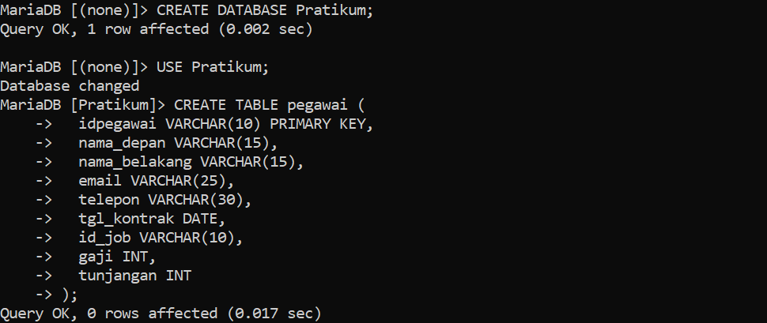
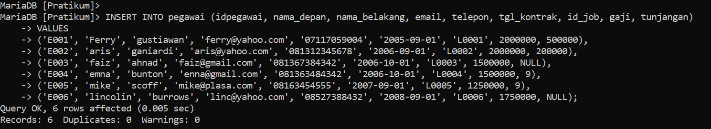
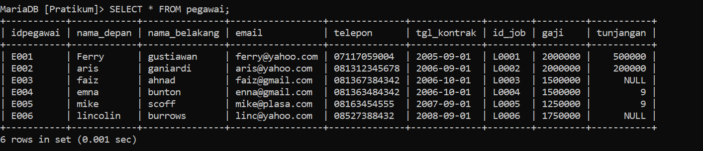

1. Tampilkan pegawai yang gaji bukan 2000000 dan 1250000 !
```
 SELECT * FROM pegawai WHERE gaji NOT IN (2000000, 1250000);
```
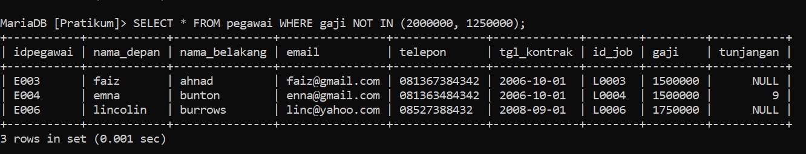
2. Tampilkan pegawai yang tunjangannya NULL!
```
 SELECT * FROM pegawai WHERE tunjangan IS NULL;
```
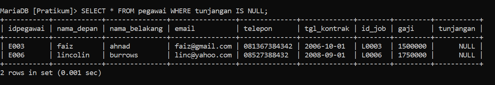
3. Tampilkan pegawai yang tunjangannya tidak NULL!
```
 SELECT * FROM pegawai WHERE tunjangan IS NOT NULL;
```
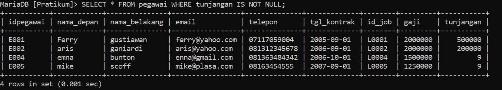
4. Tampilkan/hitung jumlah baris/record tabel pegawai!
```
 SELECT COUNT(*) FROM pegawai;
```
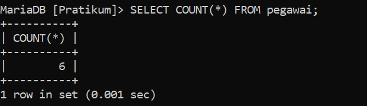
5. Tampilkan/hitung jumlah total gaji di tabel pegawai!
```
 SELECT SUM(gaji) FROM pegawai;
```
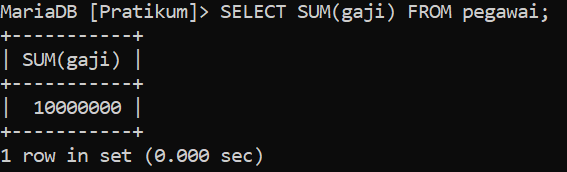
6. Tampilkan/hitung rata-rata gaji pegawai!
```
 SELECT AVG(gaji) FROM pegawai;
```
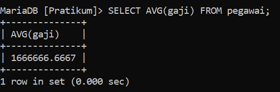
7. Tampilkan gaji terkecil!
```
 SELECT MIN(gaji) FROM pegawai;
```
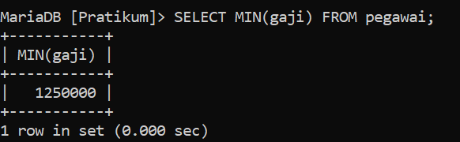
8. Tampilkan gaji terbesar!
```
 SELECT MAX(gaji) FROM pegawai;
```
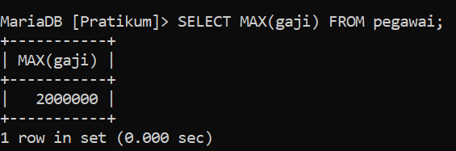

### Tabel hewan
Membuat tabel Hewan
```
 CREATE TABLE hewan (
    -> id VARCHAR(10) PRIMARY KEY,
    -> nama VARCHAR(15),
    -> owner VARCHAR(20),
    -> species VARCHAR(25),
    -> sex CHAR(1)
    -> );
```
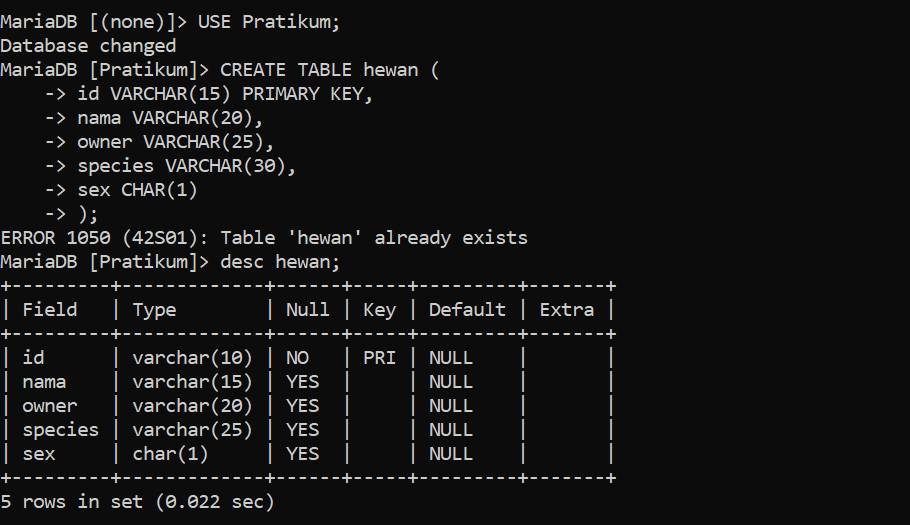
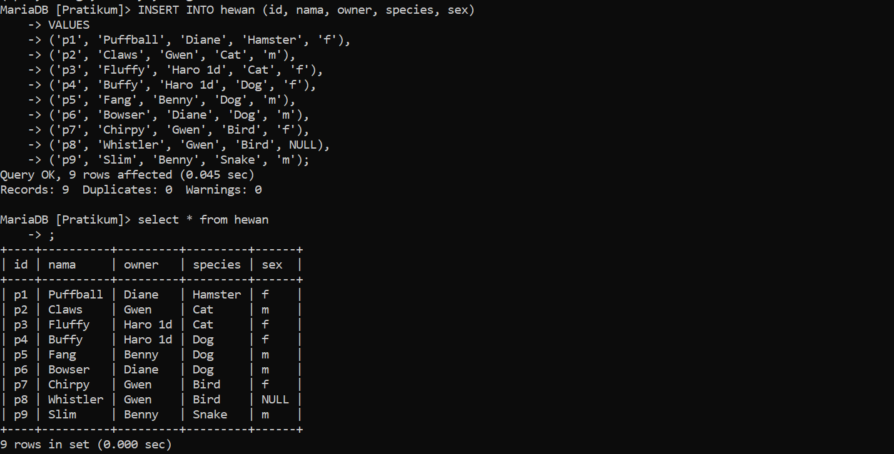
1. Tampilkan jumlah hewan yang dimiliki setiap owner.
```
 SELECT owner, COUNT(*) as jumlah_hewan FROM hewan GROUP BY owner;
```
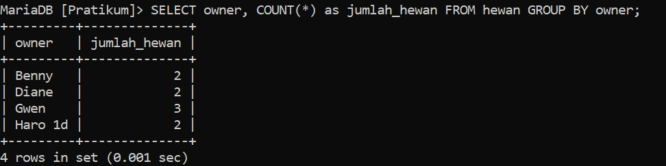
2. Tampilkan jumlah hewan berdasarkan spesies.
```
 select species, COUNT(*) as jumlah_hewan FROM hewan GROUP BY species;
```
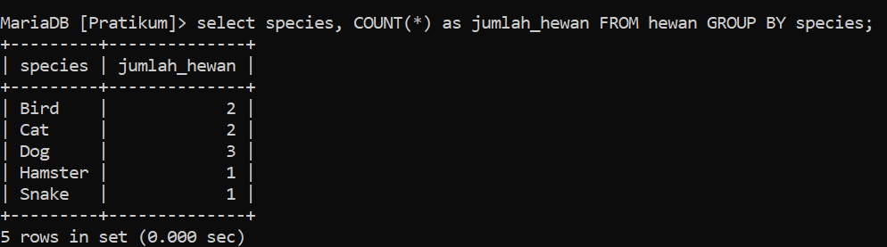
3. Tampilkan jumlah hewan berdasarkan jenis kelamin.
```
 SELECT sex, COUNT(*) as jumlah_hewan FROM hewan GROUP BY sex;
```
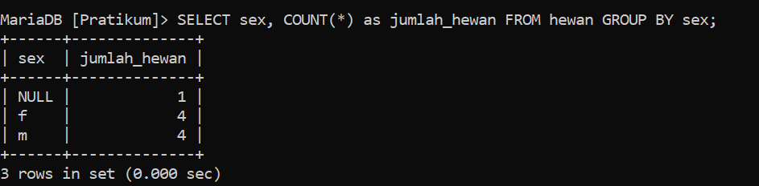
4. Tampilkan jumlah hewan berdasarkan spesies dan jenis kelamin.
```
 SELECT species, sex, COUNT(*) as jumlah_hewan FROM hewan GROUP BY species, sex;
```
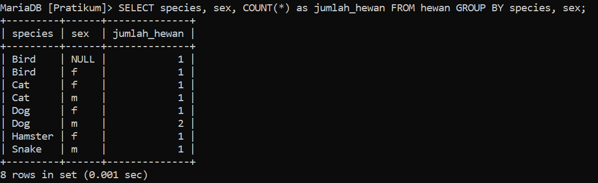
5. Tampilkan jumlah hewan berdasarkan spesis (cat dan dog saja) dan jenis kelamin.
```
 select species, sex, COUNT(*) as jumlah_hewan
    -> FROM hewan
    -> WHERE species IN ('Cat', 'Dog')
    -> GROUP BY species, sex;
```
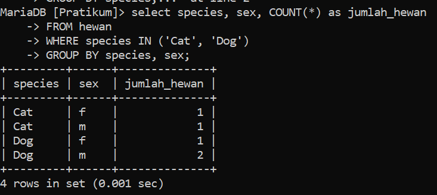
6. Tampilkan jumlah hewan berdasarkan jenis kelamin yang diketahui saja.
```
 select sex, COUNT(*) as jumlah_hewan
    -> FROM hewan
    -> WHERE sex IS NOT NULL
    -> GROUP BY sex;
```
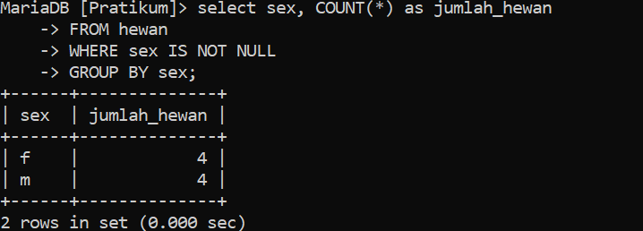
